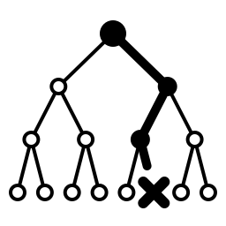

<!-- Made by `python -m beelinebench readme` from README.template.md. Edit the template, then run the command. -->

<div align="center">



# BeelineBench

**How efficiently do decision models navigate multi-step problems?**

[Results](#results) · [Method](#method) · [Domains](#domains) · [Quick start](#quick-start) · [Documentation](#documentation) · [Citation](#citation)

[](docs/benchmarks/1.0.0.md)
[](https://github.com/kyle-pena-nlp/beelinebench/actions/workflows/ci.yml)
[](pyproject.toml)
[](LICENSE)

</div>

BeelineBench measures how well a decision model plans ahead when it solves a multi-step problem. The model ranks the frontier of a best-first search, one step at a time. A model that goes more directly to the solution ("beelines") explores fewer states, and gets a higher score.

- **7 domains**: sliding puzzles, planning, arithmetic, word games, and link navigation on Wikipedia.
- **Baselines on the same trials**: the classic heuristic of each domain, random choice, and an oracle that knows the true distance to the goal.
- **Seeded and portable**: each trial, option order, and dropped state comes from seeded draws, so a trial is the same on each machine.
- **Intervals on all scores**: each score is a geometric mean over 100 trials, with a 95% bootstrap interval.
- **Open harness**: configuration-driven, with a container image. Any model that uses the Jev protocol or OpenAI's Decisions API can run. [Integrate BeelineBench with your evaluation suite](docs/lab-integration.md).

> [!NOTE]
> Classic state-space search (for example, A\*) will almost certainly remain the most efficient technique for most of these domains. BeelineBench evaluates the multi-step reasoning of decision models. It does not suggest that decision models replace classic techniques.

## Results

Benchmark [1.0.0](docs/benchmarks/1.0.0.md): 7 domains, 100 trials each, a limit of 2,500 explored nodes. Higher is better, and 1.0 is a perfect search.

| model | overall | 8-puzzle | Blocksworld | Countdown | Word ladder | Wikispeedia | Rush Hour | Keys and doors | beats the heuristic |
|---|---:|---:|---:|---:|---:|---:|---:|---:|:---:|
| Mercury Decide | **0.28\*** | **0.16** | **0.63** | 0.36 | 0.16\* | 0.67 | **0.05\*** | 0.65 | 4 of 7 |
| pplx-decider 1.0 | **0.28\*** | 0.11 | 0.54 | 0.47 | 0.18\* | **0.74** | **0.05\*** | **0.72** | 4 of 7 |
| pplx-decider 1.1 | 0.27\* | 0.10 | 0.52 | **0.49** | **0.20** | 0.71 | **0.05\*** | 0.71 | 4 of 7 |
| Jev 1.13 | 0.26\* | 0.09 | 0.52 | 0.46 | **0.20\*** | 0.71 | 0.03\* | 0.67 | 3 of 7 |
| Liquid d1 | 0.22\* | 0.10\* | 0.37 | 0.42 | 0.15\* | 0.63\* | 0.03\* | 0.66 | 3 of 7 |
| GPT-6 Luna (Decisions) | 0.19\* | **0.16** | 0.25 | 0.24 | 0.16\* | 0.61\* | 0.02\* | 0.66 | 2 of 7 |
| *Heuristic* | *0.25†* | *0.31* | *0.71* | *0.28* | *0.32* | *0.12†* | *0.04†* | *0.58* |  |
| *Random choice* | *0.01* | *0.0076* | *0.0052* | *0.05* | *0.0066* | *0.0032* | *0.0093* | *0.18* |  |

The score of a domain is the geometric mean over its trials. The overall score is the geometric mean of the domain scores, so each domain counts the same, whatever its difficulty. The best model score of each column is bold. The rows are in the order of the overall score, but many differences are smaller than the 95% intervals: the figures and [the page of the benchmark](docs/benchmarks/1.0.0.md) give them. \* or †: at least one model (\*) or heuristic (†) run did not solve within 2,500 nodes, so the true score is lower.

Main findings: [Commentary on benchmark 1.0.0](docs/benchmarks/1.0.0-commentary.md).

<details>
<summary><b>Scores by domain, with 95% intervals</b></summary>


</details>

<details>
<summary><b>Score against cost, with the efficient frontier</b></summary>


</details>

<details>
<summary><b>Percent of decisions that took a state on a shortest path</b></summary>


</details>

[All benchmark versions and their figures](docs/benchmarks/README.md)

### Sensitivity studies

Three studies measure how much the score of pplx-decider 1.1 changes on one problem:

- [Representation sensitivity](docs/benchmarks/1.0.0-representation-sensitivity.md)
- [Order sensitivity](docs/benchmarks/1.0.0-order-sensitivity.md)
- [Repeatability](docs/benchmarks/1.0.0-repeatability.md)

## Method

BeelineBench uses the model as the ranker of the frontier in a best-first search. At each step, the search sends all open states to the model in one request. The search stops when it finds the goal.

A beeline score of 1.0 is perfect: the model navigated to the solution in a minimum number of steps. A score of 0.1 means that the model explored ten times as many nodes as necessary. The score of a domain is the geometric mean over its trials, with a 95% interval over 100 random trials from the problem domain.

The score is the number of nodes in the shortest path to the solution divided by the number of nodes that the model explores:

```
score = (shortest path + 1) / nodes explored with the model
```

Before the search, a breadth-first search finds a shortest path to the goal.

BeelineBench also gives other measures on the same trials:

| measure | what it is | where |
|---|---|---|
| heuristic score | the same score for the classic heuristic of the domain. A model is better than the heuristic when its score is higher. | the score figure, and the page of each benchmark |
| random choice | the same score for a chooser that takes a state of the frontier at random. It is the floor: a model below it has choices that carry no information. The figures show it as an open circle. | the score figure, and the page of each benchmark |
| optimal choices | the percent of decisions that took a state on a shortest path, averaged over the trials. A decision counts when the frontier has a state on a shortest path and a state that is not. | the optimal choices figure, and the page of each benchmark |
| oracle score | the same score for a chooser that knows the true distance to the goal. It is below 1.0 only when the frontier limit drops a state of the shortest path. | `report` |
| path score | the shortest path divided by the length of the path that the model found, over the trials that it solved. 1.0 means that the model's path is a shortest path. | `report` |
| refusals | the share of the model's requests that it refused. Only OpenAI's Decisions API refuses. The chooser then asks once more with the options in a new order. If the API refuses that question too, the chooser takes the first option of the new order. | `report`, and [Model quirks](docs/model-quirks.md) |

All benchmark evaluations are capped at 2,500 explored nodes. Model-based runs that did not find a solution within 2,500 explored nodes are marked with an asterisk (*) on the score. Heuristic-based runs that did not find a solution within 2,500 explored nodes are marked with an obelus (†) on the heuristic score. A capped run counts as 2,500 explored nodes.

Aggregated statistics that contain at least one run that did not complete within the 2,500 node limit are marked with these symbols, and a matching footnote contains the number of trials that exceeded the limit.

The frontier holds a maximum of 255 states. If it holds more, the search drops states at random. [The frontier limit of 255 states](#the-frontier-limit-of-255-states) gives the details.


## Domains

- **8-puzzle** ([Wikipedia](https://en.wikipedia.org/wiki/15_puzzle)): the player slides eight numbered tiles on a 3 × 3 board, through one gap, until the tiles are in order.
- **Blocksworld** ([Wikipedia](https://en.wikipedia.org/wiki/Blocks_world)): a robot hand moves blocks, one at a time, until the blocks make the goal towers.
- **Countdown** ([Wikipedia](https://en.wikipedia.org/wiki/Countdown_(game_show))): the player combines four numbers with addition, subtraction, multiplication, and division to make a target number.
- **Word ladder** ([Wikipedia](https://en.wikipedia.org/wiki/Word_ladder)): the player changes one letter at a time to get from a start word to a target word, and each step must be a word.
- **Wikispeedia** ([SNAP](https://snap.stanford.edu/data/wikispeedia.html)): the player clicks links from one Wikipedia article to the next, until the player gets to the target article.
- **Rush Hour** ([Wikipedia](https://en.wikipedia.org/wiki/Rush_Hour_(puzzle))): the player slides cars and trucks on a 6 × 6 board until the red car can leave through the exit. A vehicle moves only along its own direction, and other vehicles block the path of the red car. So the player must often move a vehicle out of the way first, and sometimes move a third vehicle to make space for it. The model gets the board as six rows of letters and dots, divided by `|`. BeelineBench makes these boards at random, and each one has a solution.
- **Keys and doors**: the player walks through the rooms of a building to the exit. Each door has a color, and the key of the same color opens it. The keys are in the rooms, and a key can be behind a different door. So the player must sometimes go into a side room for a key, and then go back. The model gets the building as a list of statements in a random order, for example "The red key is behind the blue door." BeelineBench makes these buildings at random, and each one has a solution.

### Settings of benchmark 1.0.0

| domain | heuristic | state | trial |
|---|---|---|---|
| `tiles` | `manhattan` | an 8-puzzle board | 12 random moves from the solved board |
| `blocksworld` | `h_ff` | the true facts for 7 blocks and a hand | random start towers and random goal towers |
| `countdown` | `nearest_number` | the numbers that are left | 4 numbers from 1 to 25, and a target from 10 to 100 |
| `word_ladder` | `letters_different` | a five-letter word | a random word, and a target at least 5 steps away |
| `wikispeedia` | `category_distance` | a Wikipedia article title | an article pair from a completed human game, at least 3 clicks apart |
| `rush_hour` | `blocking_cars` | a 6 × 6 board of vehicles | a random board with the red car and a maximum of 10 other vehicles, at least 6 moves from the solution |
| `keys_doors` | `locked_doors` | the current room, the keys and the open doors | a random building with 10 doors, at least 12 moves from the exit |

All scores use the same scale, where 1.0 is perfect. But some domains are harder than others, so compare scores from two different domains with care.

`benchmarks.toml` holds the exact settings of each version.

Data sources: [Wikispeedia](https://snap.stanford.edu/data/wikispeedia.html) (West and Leskovec), and the word list of Knuth's Stanford GraphBase.

## Quick start

Run the mini benchmark: the first 20 trials of each domain with pplx-decider 1.1 and pplx-decider 1.0. It needs one key, `PERPLEXITY_API_KEY`, in `.env`. [Price estimates](docs/costs.md) gives its price.

```bash
git clone https://github.com/kyle-pena-nlp/beelinebench && cd beelinebench
uv sync --extra plot
uv run python -m beelinebench baseline      # the heuristic and the oracle alone; sends no requests
uv run python -m beelinebench run --mini    # sends paid requests
uv run python -m beelinebench report
```

> [!CAUTION]
> `run` sends paid API requests. The model sends one request for each node that it explores.

[Usage](docs/usage.md) gives the full steps, the configuration, and the commands.

## Documentation

| page | what it gives |
|---|---|
| [Usage](docs/usage.md) | the steps to run, the configuration, the commands, the models, and the files of a run |
| [Integrate with your evaluation suite](docs/lab-integration.md) | the package, the container, and the JSON report |
| [Benchmark versions](docs/benchmarks/README.md) | each official benchmark, with its figures and its data as tables |
| [Price estimates](docs/costs.md) | the estimated price of a mini run and a full run of each hosted model |
| [Model quirks](docs/model-quirks.md) | the behavior of the models and APIs that can change a score, and the rule for each |
| [Run Clef on your own GPU](docs/clef-local.md) | how to serve Clef and Clef-flash locally, with no API key |
| [How to contribute](CONTRIBUTING.md) | how to add a model, a problem, a protocol, or a benchmark version |
| [Changelog](CHANGELOG.md) | the changes of each version of the code and of the benchmark |

## Limitations

BeelineBench has four known limitations. Each one can change a score.

### The frontier limit of 255 states

A Jev question holds a maximum of 255 options. The search sends the full frontier as one question, so the frontier holds a maximum of 255 states. When the frontier holds more than 255 states, the search drops states at random until 255 states remain.

The heuristic arm, the oracle arm, and the model arm use the same rule. Each arm has its own seeded draws, so a trial drops the same states on each machine. The search forgets a dropped state, so it can find that state again later.

A long search fills the frontier. A Wikipedia article with many links also fills it quickly. For example, "United States" has 294 links. When the limit drops a state of the shortest path, a perfect chooser explores more states. The oracle score shows this effect. In benchmark 1.0.0, the oracle score is 1.000 for each domain except `wikispeedia`, where it is 0.987.

OpenAI's Decisions API accepted a question with 255 options in a test on 2026-10-09. Its documentation gives no limit. BeelineBench uses the limit of 255 for all models, so that all models get the same questions.

### Decision models are sensitive to the presentation

A decision model can give a different answer when it gets the same options in a different form. Two examples are known:

- **The order of the options.** Jev prefers options near the start of a list. Thus, the chooser puts the options in a new random order for each question. The order comes from seeded draws for each trial and model, so the order is the same on each machine.
- **The text of the options.** [JevChat](https://github.com/kyle-pena-nlp/jevchat) uses Jev to write text one symbol at a time. Its author found that Jev chooses much better when each option is the full text so far, not the next symbol alone.

BeelineBench writes the states of a domain in one fixed form. A different form, for example a board as a grid and not as one line, can give a different score. Thus, a score measures a model together with the form of the states, not the model alone. [Representation sensitivity](docs/benchmarks/1.0.0-representation-sensitivity.md) and [order sensitivity](docs/benchmarks/1.0.0-order-sensitivity.md) measure these effects on one problem.

### Some APIs have no seed

The Jev protocol accepts only the fields `model`, `state`, and `questions`. It rejects all other fields, for example `seed` or `temperature`. Jev, pplx-decider, Clef, and the models on OpenRouter use this protocol. BeelineBench also sends no seed to OpenAI's Decisions API.

Identical requests can give different probabilities. In one test, the top option of Jev got 0.78, 0.78, and 0.83 in three calls. A different choice early in a search changes the remainder of the search. Thus, a second run of the same trial can give a different score.

BeelineBench fixes its own random values: the trials, the option order, and the dropped states. It cannot fix the answers of the model, so the results are not fully deterministic. The 95% interval does not include this variation. [Repeatability](docs/benchmarks/1.0.0-repeatability.md) measures it on one problem.

### The models and their APIs have quirks

Some behavior of the models and their APIs can change a score. [Model quirks](docs/model-quirks.md) describes each behavior, and the rule that BeelineBench uses for it: the served model, refusals, dated model names, a short context, models that BeelineBench cannot use, and errors from the APIs.

## Related benchmarks

These benchmarks also measure decision models. Each one asks single questions. BeelineBench asks a sequence of questions, in which each choice changes the next question.

- [Decision Index](https://huggingface.co/spaces/multimodalart/jev-decision-index) ([code](https://github.com/apolinario/decision-index), [Cloudflare's copy](https://clef-evals.workers-ai-mle.workers.dev/)): more than 70 decision models, on single questions and games.
- [S1MB](https://huggingface.co/blog/hotchpotch/system-one-mosaic-benchmark) ([code](https://github.com/hotchpotch/S1MB), [leaderboard](https://huggingface.co/spaces/hotchpotch/S1MB-leaderboard)): 137 benchmarks of yes-or-no, choice and score questions, from NLP datasets. A Borda ranking combines them.
- [AIM-Decision](https://aimultiple.com/decision-models) (AIMultiple): 1,655 classification questions, and 50 browser tasks. It compares decision models with general LLMs.
- [OpenRouter decision model rankings](https://openrouter.ai/rankings/decisions): the number of requests to each model. It does not measure accuracy.

## Contributing

[How to contribute](CONTRIBUTING.md) tells you how to add a model, a problem, a protocol, or a benchmark version. AI-assisted code is okay, but a person must write the description of a pull request, and it must match the contents of the pull request in all material ways.

## Citation

If you use BeelineBench, cite it as follows. Give the benchmark version that you used, because the code and the benchmarks have separate versions.

```bibtex
@software{pena2026beelinebench,
  author  = {Pena, Kyle},
  title   = {{BeelineBench}: How Efficiently Do Decision Models Navigate Multi-Step Problems?},
  year    = {2026},
  version = {1.0.0},
  note    = {Benchmark 1.0.0},
  url     = {https://github.com/kyle-pena-nlp/beelinebench}
}
```

If you publish results on the Wikispeedia domain, also cite the two papers of its dataset: West and Leskovec, "Human Wayfinding in Information Networks" (WWW 2012), and West, Pineau, and Precup, "Wikispeedia: An Online Game for Inferring Semantic Distances between Concepts" (IJCAI 2009).

## License

BeelineBench is licensed under the [Apache License, Version 2.0](LICENSE). [NOTICE](NOTICE) lists the third-party data and its terms:

- The word list of the word ladder domain is from Donald E. Knuth's Stanford GraphBase, which is in the public domain.
- The Wikispeedia data is from the [Stanford Network Analysis Project](https://snap.stanford.edu/data/wikispeedia.html). SNAP gives no license for it. Thus, BeelineBench and its Docker image do not include it. A run fetches it from SNAP when it needs it.

## Support BeelineBench

Each run of a hosted model costs money. The full runs of the six models in 1.0.0 cost about $120 in API fees. The pilots and the sensitivity studies cost about $30 more. The local Clef runs need a rented GPU. To pay for more models and new versions of the benchmark, [sponsor BeelineBench on GitHub](https://github.com/sponsors/kyle-pena-nlp).
