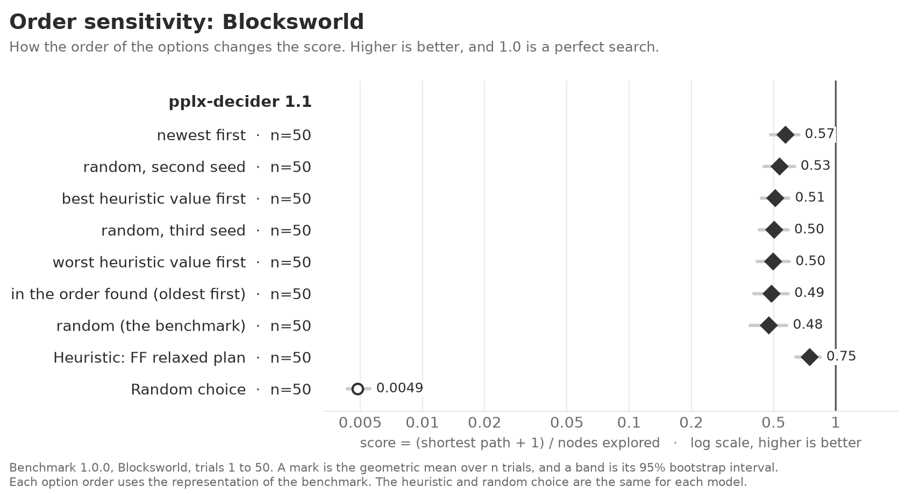

<!-- Made by `python -m beelinebench readme` from docs/benchmarks/order-sensitivity.template.md. Edit the template, then run the command. -->

# Order sensitivity: benchmark 1.0.0

A decision model gets the options of each question in an order. This study measures how much that order changes the score of each model on one problem. The models are pplx-decider 1.1. The `[sensitivity]` table of `beelinebench.toml` selects the models, the problem, and the orders. `uv run python -m beelinebench case-study` runs it.

The problem is Blocksworld, with the benchmark representation. The study compares seven option orders:

- three random orders with different seeds. The first is the order of the benchmark.
- the order in which the search found the states, the oldest first, and the reverse of this order.
- the states with the best heuristic value first, and the states with the worst value first.

An order from the heuristic gives the model information that the benchmark does not give. These two orders measure how much the model follows the position of an option. The three random orders show the variation that comes from the order alone.

## The figure as text

The problem is Blocksworld, trials 1 to 50. The rows are in the order of the figure.

#### pplx-decider 1.1

| | trials | score | 95% interval |
|---|---|---|---|
| newest first | 50 | 0.57 | 0.48 to 0.66 |
| random, second seed | 50 | 0.53 | 0.45 to 0.63 |
| best heuristic value first | 50 | 0.51 | 0.44 to 0.59 |
| random, third seed | 50 | 0.50 | 0.43 to 0.59 |
| worst heuristic value first | 50 | 0.50 | 0.42 to 0.60 |
| in the order found (oldest first) | 50 | 0.49 | 0.40 to 0.59 |
| random (the benchmark) | 50 | 0.48 | 0.38 to 0.58 |
| Heuristic: FF relaxed plan | 50 | 0.75 | 0.64 to 0.84 |
| Random choice | 50 | 0.0049 | 0.0043 to 0.0056 |

