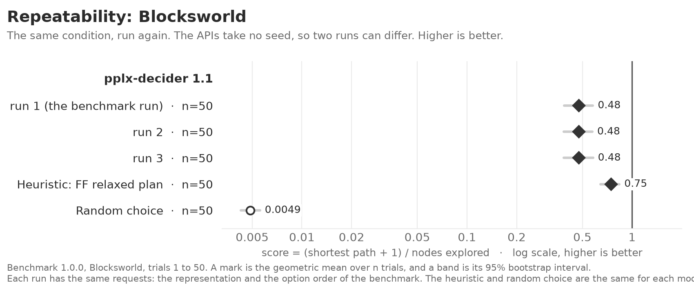

<!-- Made by `python -m beelinebench readme` from docs/benchmarks/repeatability.template.md. Edit the template, then run the command. -->

# Repeatability: benchmark 1.0.0

The APIs of the decision models take no seed. Thus, two runs of the same requests can give different answers, and a different choice early in a search changes the remainder of the search. This study runs the same condition more than once, and measures how much the score of each model changes between runs. The models are pplx-decider 1.1.

The problem is Blocksworld, with the representation and the option order of the benchmark. Each run sends the same first request for each trial. Run 1 is the benchmark run. The `repeats` setting of the `[sensitivity]` table of `beelinebench.toml` sets the number of runs. `uv run python -m beelinebench case-study` runs it.

A difference between two runs here is the variation that the 95% interval of the benchmark does not include. [Representation sensitivity](1.0.0-representation-sensitivity.md) and [order sensitivity](1.0.0-order-sensitivity.md) compare their differences with this variation.

## The figure as text

The problem is Blocksworld, trials 1 to 50. The rows are in the order of the figure.

#### pplx-decider 1.1

| | trials | score | 95% interval |
|---|---|---|---|
| run 1 (the benchmark run) | 50 | 0.48 | 0.39 to 0.58 |
| run 2 | 50 | 0.48 | 0.39 to 0.58 |
| run 3 | 50 | 0.48 | 0.39 to 0.58 |
| Heuristic: FF relaxed plan | 50 | 0.75 | 0.64 to 0.84 |
| Random choice | 50 | 0.0049 | 0.0043 to 0.0056 |

