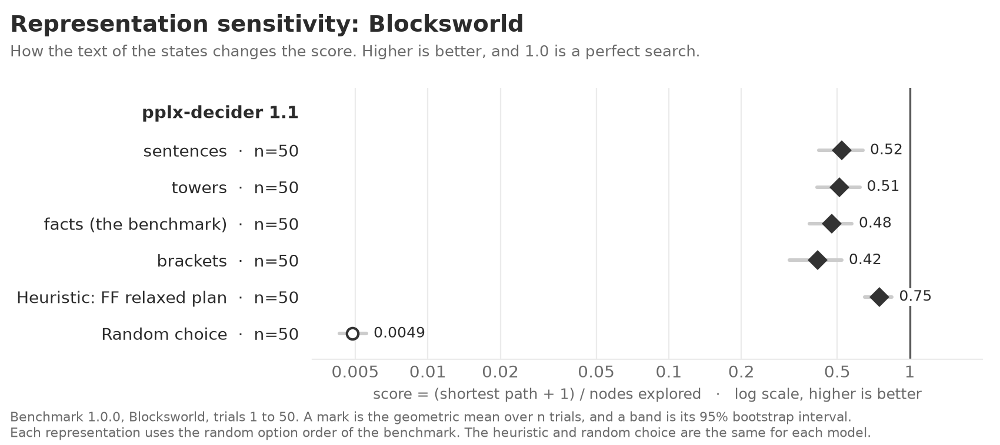

<!-- Made by `python -m beelinebench readme` from docs/benchmarks/representation-sensitivity.template.md. Edit the template, then run the command. -->

# Representation sensitivity: benchmark 1.0.0

A decision model gets each state as text. This study measures how much the text of the states changes the score of each model on one problem. The models are pplx-decider 1.1. The `[sensitivity]` table of `beelinebench.toml` selects the models, the problem, and the representations. `uv run python -m beelinebench case-study` runs it.

The problem is Blocksworld. Its benchmark representation is a list of PDDL facts. The study compares four representations of the same states:

| representation | example |
|---|---|
| facts (the benchmark) | `(clear b2) (handempty) (on b2 b3) (ontable b3)` |
| sentences | `Nothing is on block 2. The hand is empty. Block 2 is on block 3. Block 3 is on the table.` |
| towers | `a tower of b3, b2 (from the table up); the hand is empty` |
| brackets | `[b3 b2] hand: -` |

Each representation also writes the goal and the rules of the hand in its own form. Each representation uses the same random option order, so only the text changes. [Repeatability](1.0.0-repeatability.md) shows how much two runs of the same condition differ. Compare a difference here with that variation.

## The figure as text

The problem is Blocksworld, trials 1 to 50. The rows are in the order of the figure.

#### pplx-decider 1.1

| | trials | score | 95% interval |
|---|---|---|---|
| sentences | 50 | 0.52 | 0.42 to 0.64 |
| towers | 50 | 0.51 | 0.41 to 0.62 |
| facts (the benchmark) | 50 | 0.48 | 0.38 to 0.57 |
| brackets | 50 | 0.42 | 0.32 to 0.52 |
| Heuristic: FF relaxed plan | 50 | 0.75 | 0.65 to 0.84 |
| Random choice | 50 | 0.0049 | 0.0043 to 0.0056 |

