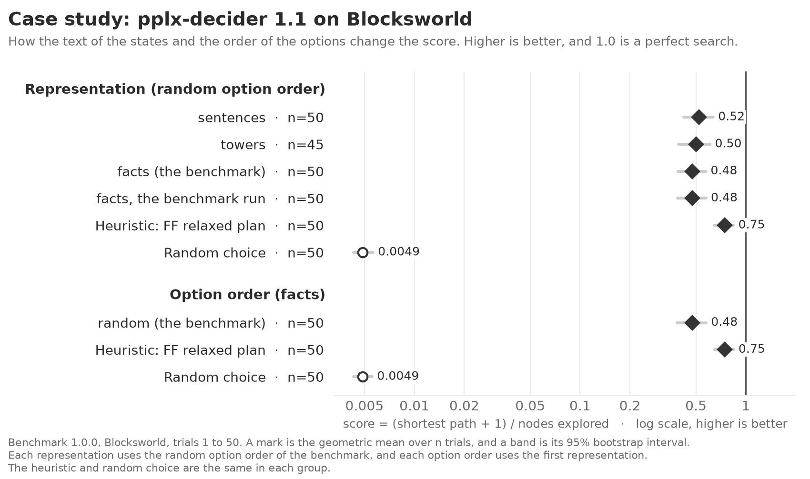

<!-- Made by `python -m beelinebench readme` from docs/benchmarks/robustness-case-study.template.md. Edit the template, then run the command. -->

# Robustness case study: benchmark 1.0.0

A decision model gets each state as text, and it gets the options of a question in an order. This case study measures how much these two choices change the score of one model on one problem. The `[case_study]` table of `beelinebench.toml` selects the model, the problem, the representations, and the option orders. `uv run python -m beelinebench case-study` runs it.

The problem is Blocksworld. Its benchmark representation is a list of PDDL facts, for example `(on b2 b3)`. The case study compares four representations of the same states:

| representation | example |
|---|---|
| facts (the benchmark) | `(clear b2) (handempty) (on b2 b3) (ontable b3)` |
| sentences | `Nothing is on block 2. The hand is empty. Block 2 is on block 3. Block 3 is on the table.` |
| towers | `a tower of b3, b2 (from the table up); the hand is empty` |
| brackets | `[b3 b2] hand: -` |

Each representation also writes the goal and the rules of the hand in its own form. Each representation uses the same random option order, so only the text changes.

The case study also compares seven option orders, with the facts representation:

- three random orders with different seeds, the first of which is the order of the benchmark;
- the order in which the search found the states, the oldest first, and the reverse of this order;
- the states with the best heuristic value first, and the states with the worst value first.

An order from the heuristic gives the model information that the benchmark does not give. These two orders measure how much the model follows the position of an option.

The representation group also shows the benchmark run of the model on the same trials. This run and "facts" have the same condition. The difference between them shows the variation between two runs, because the API has no seed.

## The figure as text

The model is pplx-decider 1.1, and the problem is Blocksworld, trials 1 to 50. The rows are in the order of the figure, best first.

#### Representation (random option order)

| | trials | score | 95% interval |
|---|---|---|---|
| sentences | 50 | 0.52 | 0.42 to 0.64 |
| towers | 45 | 0.50 | 0.39 to 0.61 |
| facts (the benchmark) | 50 | 0.48 | 0.39 to 0.57 |
| facts, the benchmark run | 50 | 0.48 | 0.39 to 0.58 |
| Heuristic: FF relaxed plan | 50 | 0.75 | 0.64 to 0.84 |
| Random choice | 50 | 0.0049 | 0.0043 to 0.0056 |

#### Option order (facts)

| | trials | score | 95% interval |
|---|---|---|---|
| random (the benchmark) | 50 | 0.48 | 0.39 to 0.58 |
| Heuristic: FF relaxed plan | 50 | 0.75 | 0.65 to 0.84 |
| Random choice | 50 | 0.0049 | 0.0043 to 0.0056 |

[Back to the README](../../README.md)
