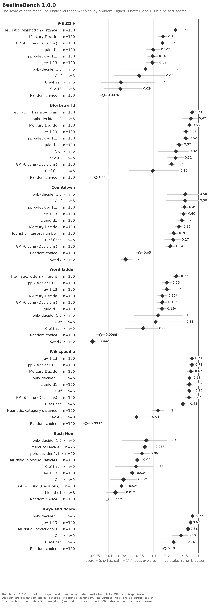
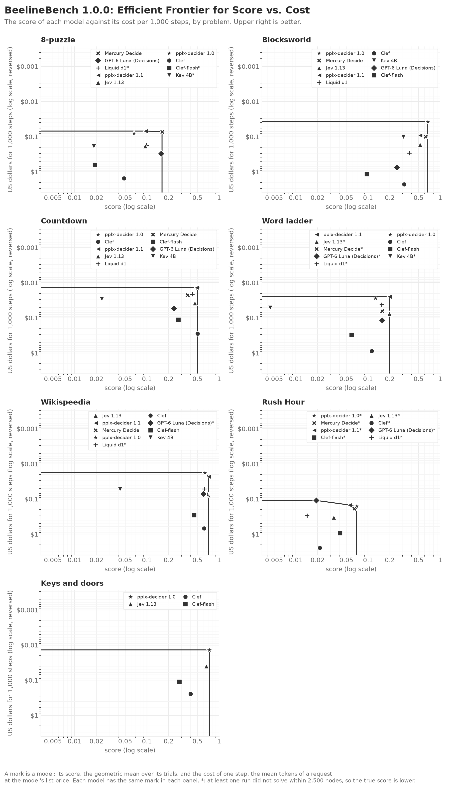
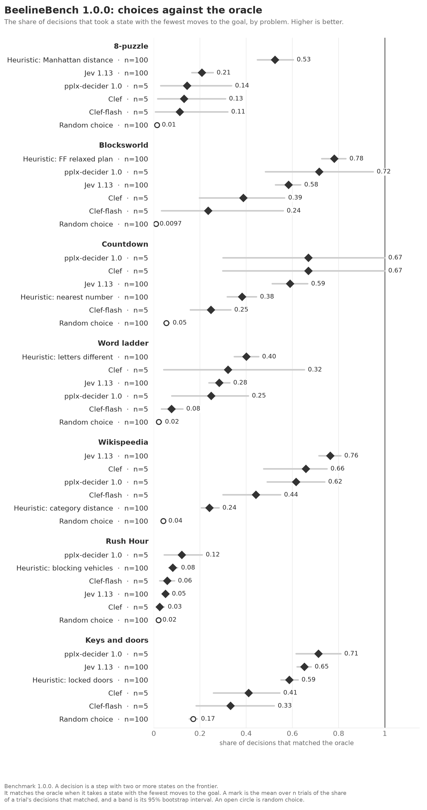

<!-- Made by `python -m beelinebench readme` from benchmarks.toml. Do not edit. -->
# The benchmarks

Each official benchmark of `benchmarks.toml` has a page here. A new version adds a
page, and no page is removed. CI fails when a benchmark has no page, or when this
file is out of date.

| benchmark | domains | trials for each domain | node limit | frontier limit |
|---|---|---|---|---|
| [1.0.0](1.0.0.md) | 7 | 100 | 2,500 | 255 |

## Scores

### Benchmark 1.0.0

## Score and cost

### Benchmark 1.0.0

## Choices against the oracle

### Benchmark 1.0.0

