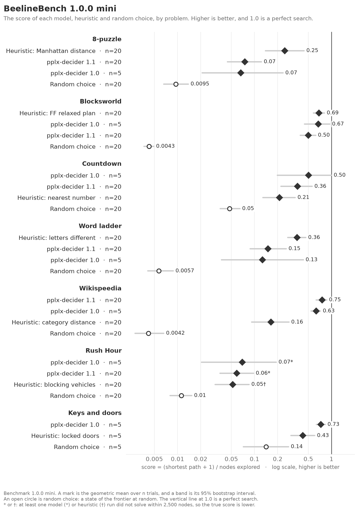
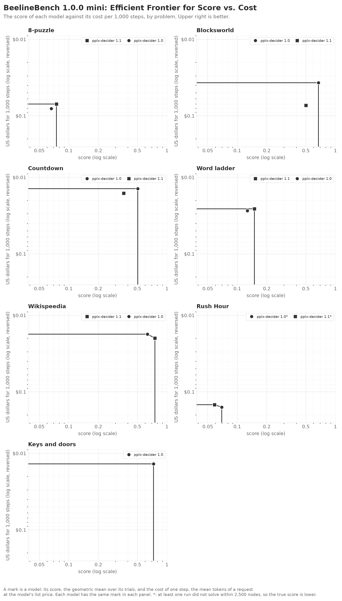
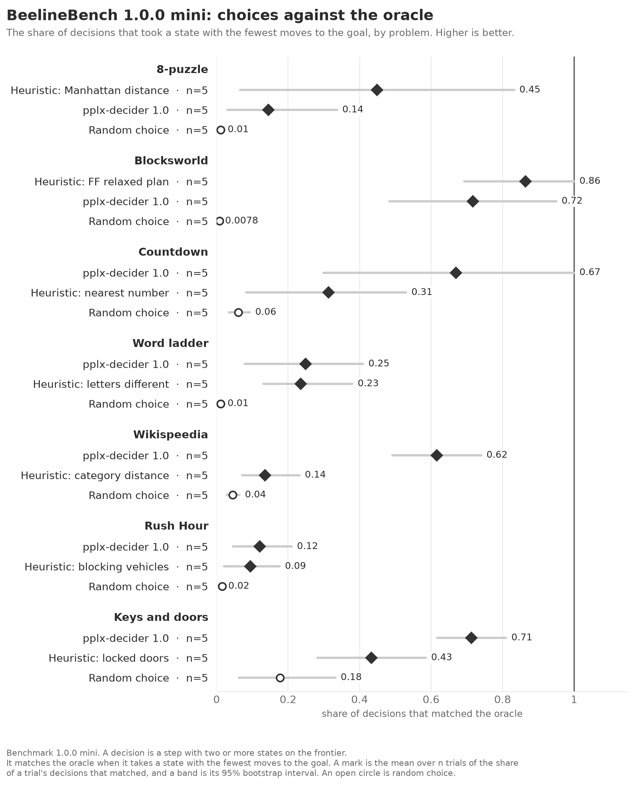

<!-- Made by `python -m beelinebench readme` from benchmarks.toml. Do not edit. -->
# The mini benchmarks

The mini benchmark of a version is its first 20 trials of each domain, with
pplx-decider 1.1, pplx-decider 1.0. These models come from one provider, so a run needs one key.
`uv run python -m beelinebench run --mini` runs it. Trial n is the same trial as in the
full benchmark, so a mini score is the full score of fewer trials, with wider intervals.
[The benchmarks](../README.md) has the full results.

## Benchmark 1.0.0 mini

### Scores as text

The rows of each problem are in the order of the figure, best first. A score is the geometric mean over the trials, and the interval is its 95% bootstrap interval. \* or †: at least one model (\*) or heuristic (†) run did not solve within 2,500 nodes, so the true score is lower.

#### 8-puzzle

| | trials | score | 95% interval |
|---|---|---|---|
| Heuristic: Manhattan distance | 20 | 0.25 | 0.14 to 0.44 |
| pplx-decider 1.1 | 20 | 0.07 | 0.04 to 0.12 |
| pplx-decider 1.0 | 5 | 0.07 | 0.02 to 0.24 |
| Random choice | 20 | 0.0095 | 0.0066 to 0.01 |

#### Blocksworld

| | trials | score | 95% interval |
|---|---|---|---|
| Heuristic: FF relaxed plan | 20 | 0.69 | 0.58 to 0.81 |
| pplx-decider 1.0 | 5 | 0.67 | 0.45 to 0.95 |
| pplx-decider 1.1 | 20 | 0.50 | 0.39 to 0.62 |
| Random choice | 20 | 0.0043 | 0.0037 to 0.0049 |

#### Countdown

| | trials | score | 95% interval |
|---|---|---|---|
| pplx-decider 1.0 | 5 | 0.50 | 0.20 to 1.00 |
| pplx-decider 1.1 | 20 | 0.36 | 0.22 to 0.56 |
| Heuristic: nearest number | 20 | 0.21 | 0.13 to 0.34 |
| Random choice | 20 | 0.05 | 0.04 to 0.06 |

#### Word ladder

| | trials | score | 95% interval |
|---|---|---|---|
| Heuristic: letters different | 20 | 0.36 | 0.27 to 0.47 |
| pplx-decider 1.1 | 20 | 0.15 | 0.09 to 0.26 |
| pplx-decider 1.0 | 5 | 0.13 | 0.04 to 0.43 |
| Random choice | 20 | 0.0057 | 0.0041 to 0.0088 |

#### Wikispeedia

| | trials | score | 95% interval |
|---|---|---|---|
| pplx-decider 1.1 | 20 | 0.75 | 0.63 to 0.87 |
| pplx-decider 1.0 | 5 | 0.63 | 0.54 to 0.72 |
| Heuristic: category distance | 20 | 0.16 | 0.09 to 0.28 |
| Random choice | 20 | 0.0042 | 0.0028 to 0.0066 |

#### Rush Hour

| | trials | score | 95% interval |
|---|---|---|---|
| pplx-decider 1.0 | 5 | 0.07\* | 0.02 to 0.19 |
| pplx-decider 1.1 | 20 | 0.06\* | 0.04 to 0.10 |
| Heuristic: blocking vehicles | 20 | 0.05† | 0.03 to 0.09 |
| Random choice | 20 | 0.01 | 0.0080 to 0.02 |

#### Keys and doors

| | trials | score | 95% interval |
|---|---|---|---|
| pplx-decider 1.0 | 5 | 0.73 | 0.64 to 0.83 |
| Heuristic: locked doors | 5 | 0.43 | 0.30 to 0.61 |
| Random choice | 5 | 0.14 | 0.07 to 0.28 |

### Score and cost as text

A step is one request. Its cost is the mean tokens of a request at the list price of the model. A model on the frontier is on the line of the figure: no other model, and no mix of two models, is both cheaper and better. The rows are best score first.

#### 8-puzzle

| model | score | US dollars for 1,000 steps | on the frontier |
|---|---|---|---|
| pplx-decider 1.1 | 0.07 | $0.070 | yes |
| pplx-decider 1.0 | 0.07 | $0.080 |  |

#### Blocksworld

| model | score | US dollars for 1,000 steps | on the frontier |
|---|---|---|---|
| pplx-decider 1.0 | 0.67 | $0.037 | yes |
| pplx-decider 1.1 | 0.50 | $0.073 |  |

#### Countdown

| model | score | US dollars for 1,000 steps | on the frontier |
|---|---|---|---|
| pplx-decider 1.0 | 0.50 | $0.014 | yes |
| pplx-decider 1.1 | 0.36 | $0.016 |  |

#### Word ladder

| model | score | US dollars for 1,000 steps | on the frontier |
|---|---|---|---|
| pplx-decider 1.1 | 0.15 | $0.026 | yes |
| pplx-decider 1.0 | 0.13 | $0.027 |  |

#### Wikispeedia

| model | score | US dollars for 1,000 steps | on the frontier |
|---|---|---|---|
| pplx-decider 1.1 | 0.75 | $0.020 | yes |
| pplx-decider 1.0 | 0.63 | $0.018 | yes |

#### Rush Hour

| model | score | US dollars for 1,000 steps | on the frontier |
|---|---|---|---|
| pplx-decider 1.0 | 0.07\* | $0.16 | yes |
| pplx-decider 1.1 | 0.06\* | $0.15 | yes |

#### Keys and doors

| model | score | US dollars for 1,000 steps | on the frontier |
|---|---|---|---|
| pplx-decider 1.0 | 0.73 | $0.014 | yes |

### Choices against the oracle as text

A decision is a step with two or more states on the frontier, and at least one of them can reach the goal. The oracle regret of a decision is the moves to the goal from the chosen state, minus the fewest moves from a state of the frontier. So an optimal choice has a regret of 0. A dead end is a chosen state that cannot reach the goal. Each column is a mean over trials, so each trial counts the same.

#### 8-puzzle

| | trials | matched the oracle | mean regret | dead ends |
|---|---|---|---|---|
| Heuristic: Manhattan distance | 5 | 45% | 3.66 | 0.0% |
| pplx-decider 1.0 | 5 | 14% | 6.34 | 0.0% |
| Random choice | 5 | 1% | 13.56 | 0.0% |

#### Blocksworld

| | trials | matched the oracle | mean regret | dead ends |
|---|---|---|---|---|
| Heuristic: FF relaxed plan | 5 | 86% | 0.30 | 0.0% |
| pplx-decider 1.0 | 5 | 72% | 0.99 | 0.0% |
| Random choice | 5 | 1% | 6.35 | 0.0% |

#### Countdown

| | trials | matched the oracle | mean regret | dead ends |
|---|---|---|---|---|
| pplx-decider 1.0 | 5 | 67% | 0.00 | 33.0% |
| Heuristic: nearest number | 5 | 31% | 0.05 | 68.6% |
| Random choice | 5 | 6% | 0.40 | 90.5% |

#### Word ladder

| | trials | matched the oracle | mean regret | dead ends |
|---|---|---|---|---|
| pplx-decider 1.0 | 5 | 25% | 2.31 | 0.0% |
| Heuristic: letters different | 5 | 23% | 1.95 | 0.0% |
| Random choice | 5 | 1% | 4.65 | 0.0% |

#### Wikispeedia

| | trials | matched the oracle | mean regret | dead ends |
|---|---|---|---|---|
| pplx-decider 1.0 | 5 | 62% | 0.45 | 0.0% |
| Heuristic: category distance | 5 | 14% | 1.52 | 0.0% |
| Random choice | 5 | 4% | 1.63 | 0.0% |

#### Rush Hour

| | trials | matched the oracle | mean regret | dead ends |
|---|---|---|---|---|
| pplx-decider 1.0 | 5 | 12% | 2.55 | 0.0% |
| Heuristic: blocking vehicles | 5 | 9% | 2.91 | 0.0% |
| Random choice | 5 | 2% | 4.02 | 0.0% |

#### Keys and doors

| | trials | matched the oracle | mean regret | dead ends |
|---|---|---|---|---|
| pplx-decider 1.0 | 5 | 71% | 0.69 | 0.0% |
| Heuristic: locked doors | 5 | 43% | 1.93 | 0.0% |
| Random choice | 5 | 18% | 3.35 | 0.0% |
